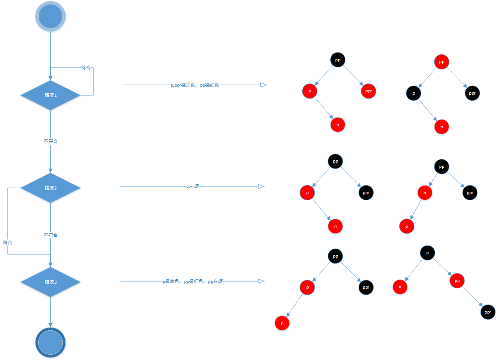
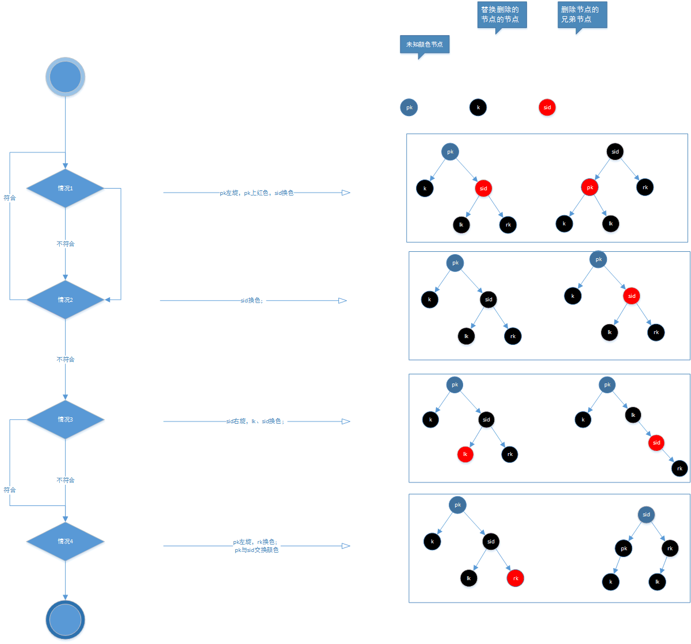

# 红黑树

## 性质
1. 节点为红色或黑色
2. 根节点为黑色
3. 所有叶子节点为黑色（叶子节点是为null的节点）
4. 红色节点必须要有两个黑色子节点（叶子节点到根节点的路径上，不能有两个连续的红色节点）
5. 从任一节点到其每个叶子节点的所有简单路径都包含相同数目的黑色节点（简称黑高）

## 两个操作
### 查找
深度优先遍历红黑树查找key值

### 新增
添加节点就是处理添加节点的父节点为红色的而打破性质4的情况。
考虑策略摆平这个情况就好了。
1. 从0到有
    1. 直接添加即可
2. 添加节点的父节点为黑色节点
    1. 直接添加即可
3. 添加节点的父节点为红色节点
    1. 参考下图:

说明：p-父节点 pp-亲爷爷节点 ppr--亲叔叔节点 n-当前节点
    

### 删除
删除红黑树红色节点不会打破红黑树的平衡，那么直接删掉就好了。
但是删除黑色节点会打破平衡，就需要处理了，仔细考虑一下，只是违反性质5，并且打破平衡也就是删除节点所对应的叶子及节点的黑高到删除节点的父节点会比到可达的叶子节点少了一个节点而已。
考虑一个将缺少的黑色节点添加上就可以了。
分多个情况
1. 删除的节点为根节点，并且当前的只有一个节点
    1. 直接删除即可
2. 删除节点为红色
    1. 不打破红黑树的性质，替换节点颜色为黑色即可
3. 删除节点不为红色
    1. 子节点为红色
        1. 删除节点，将子节点变为黑色即可
    2. 子节点为黑色
        1. 参考下图:

说明：k-当前节点 pk-父节点 sid-亲兄弟节点 rl-亲兄弟节点的右子节点 ll-亲兄弟节点的左子节点

## 总结
看了一天，现在感觉红黑树好像并不是那么高不可攀了。毕竟学会了。
想了想，红黑树其实和玩魔方有异曲同工之妙，都tm是策略（套路），只要知道什么策略，就自然知道怎么操作了。套路越熟悉，越了解，越简化，那么玩的速度就越快。

## 附加
[推荐一个数据结构可视化的网站](https://www.cs.usfca.edu/~galles/visualization/Algorithms.html)
