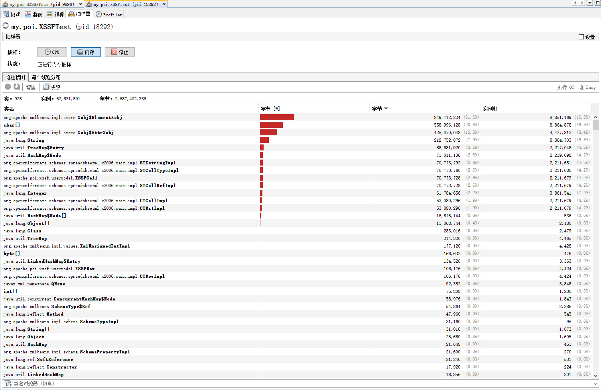
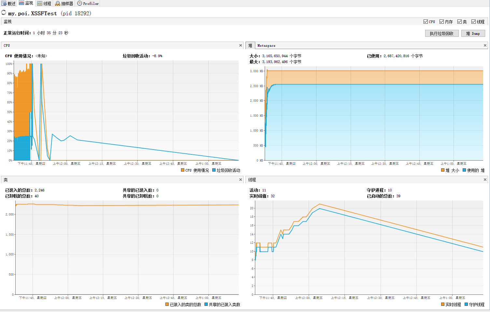
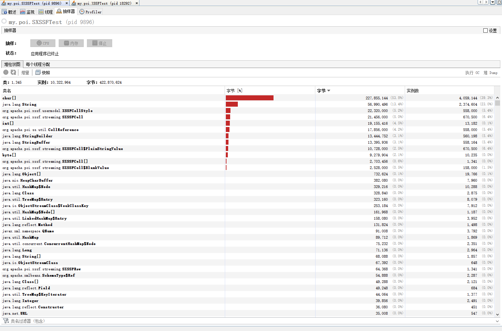
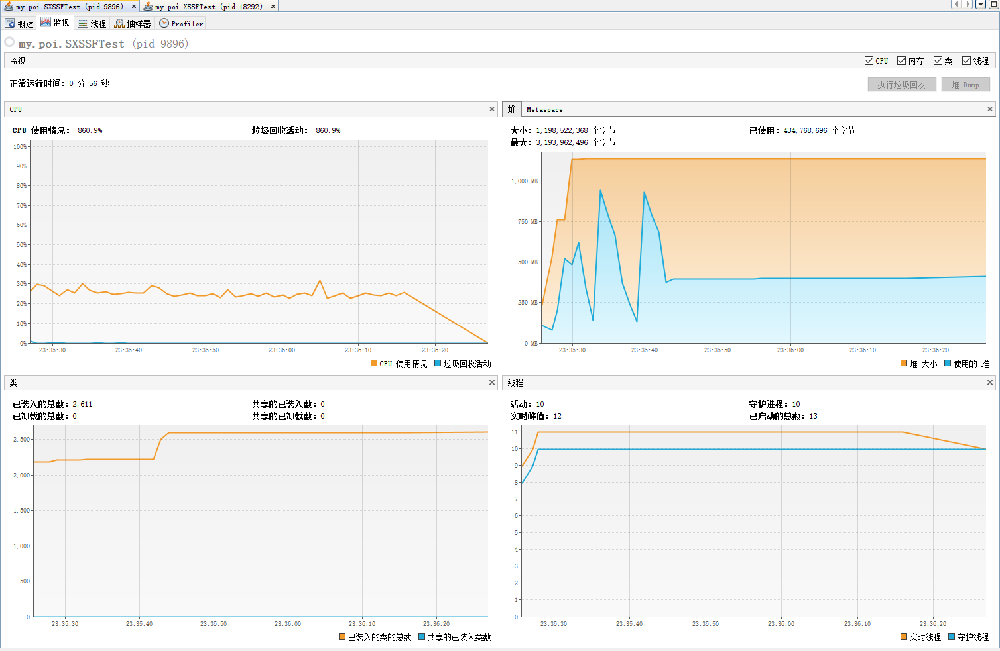

# 从Excel导出宕机到初学Apache POI


## 学习来由
因为在定位一个公司的OOM的时候，花了2天时间，定位问题定位出了方向，知道是导出Excel的时候对象占用太大导致的OOM，但是后来计算了一下数据完全没有达到OOM的情况。症结点就是结论是没错只是连自己都没法说服，那玩啥，初步优化解决方案目测是没太大作用，毕竟不清楚根本原因是啥！

然后就没啥头绪，卡死在这个点上了。后来组内大神定位出是大数据量Excel导出中使用的是POI中的XSSFWorkbook对象导致系统的内存占用过高，最终导致OOM后宕机。下面是大神的分析：

> 当数据量超出65536条后，在使用HSSFWorkbook或XSSFWorkbook，程序会报OutOfMemoryError：Javaheap space;内存溢出错误。这时应该用SXSSFworkbook。

嗯，关于POI是啥我一点也不知道，更别说XSSFWorkbook etc。通过这次定位问题简单知道POI是一个文件OI的工具，具体机制以及内部原理是啥，怎么进行编码完全是一脸懵逼状态。@_@

作为码农这其实是简单通用的框架了，必须要知道；另外这可是本汪以后吃饭的家伙，必须做到专业来着。老话说亡羊补牢，简单学习一下基本操作，重点学习导出。

## Why should I use Apache POI?

[来源：Apache POI](https://poi.apache.org/)

A major use of the Apache POI api is for Text Extraction applications such as web spiders, index builders, and content management systems.

So why should you use POIFS, HSSF or XSSF?

You'd use POIFS if you had a document written in OLE 2 Compound Document Format, probably written using MFC, that you needed to read in Java. Alternatively, you'd use POIFS to write OLE 2 Compound Document Format if you needed to inter-operate with software running on the Windows platform. We are not just bragging when we say that POIFS is the most complete and correct implementation of this file format to date!

You'd use HSSF if you needed to read or write an Excel file using Java (XLS). You'd use XSSF if you need to read or write an OOXML Excel file using Java (XLSX). The combined SS interface allows you to easily read and write all kinds of Excel files (XLS and XLSX) using Java. Additionally there is a specialized SXSSF implementation which allows to write very large Excel (XLSX) files in a memory optimized way.

> OLE: (Object Linkingand Embedding)对象链接和嵌入
>
> MFC:(Microsoft Foundation Classes)微软基础类库
>
> OOXML: (Office Open XML standards)微软公司为Office 2007产品开发的技术规范，现已成为国际文档格式标准，兼容前国际标准开放文档格式和中国文档标准“标文通”（外语简称：UOF）。
>
> Excel workbooks (SS=HSSF+XSSF)

POI工具用于文档提取应用，如：网页爬虫，索引构建，系统管理。

使用Java进行OLE2格式的读写使用POIFS。

使用Java读写.xls格式的Excel表格使用HSSF，读写.xlsx格式Excel表格使用XSSF，SS就可以同时处理两种格式的Excel表格。
另外，大量数据的导出使用优化过的SXSSF。

## 测试环境
>操作系统：windows 10 专业版
>
>处理器：Intel Core(TM) i5-4200M CPU @2.5GHz 
>
>内存：12G
>
> JVM: Java HotSpot(TM) 64-Bit Server VM (25.72-b15, mixed mode)
>
>Java: 版本 1.8.0_72, 供应商 Oracle Corporation

## 测试代码
```` java
package my.poi;

import org.apache.poi.ss.usermodel.Cell;
import org.apache.poi.ss.usermodel.Row;
import org.apache.poi.ss.usermodel.Sheet;
import org.apache.poi.ss.usermodel.Workbook;
import org.apache.poi.xssf.usermodel.XSSFWorkbook;

import java.io.FileOutputStream;
import java.io.IOException;
import java.io.OutputStream;


public class XSSF {

    public static void main(String[] args) throws IOException, InterruptedException {
        // Thread.sleep(3 * 1000);  这个是为了能够使用监控到内存的使用
        (new XSSF()).generateXLSX(8, 5000, 500);
    }

    public void generateXLSX(int sheetNum, int rowNum, int column) {
        String fileName = FILE_PATH + FILE_NAME_PREFIX + (rowNum * sheetNum) + SEPARATOR + new Random().nextLong() + FILE_NAME_SUFFIX;
        OutputStream out = new FileOutputStream(fileName);
        Workbook workbook = generateSheet(sheetNum, rowNum, column);
        workbook.write(out);
        workbook.close();
        out.close();
    }

    private Workbook generateSheet(int sheetNum, int rowNum, int column) throws IOException {
        Workbook workbook = new XSSFWorkbook();  //其实就是就是new一个对象的问题@_@
        for (int sheetIndex = 0; sheetIndex < sheetNum; sheetIndex++) {
            String sheetName = SHEET_NAME_PREFIX + SEPARATOR + sheetIndex;
            Sheet sheet = workbook.createSheet(sheetName);
            for (int i = 0; i < rowNum; i++) {
                Row row = sheet.createRow(i);
                for (int j = 0; j < column; j++) {
                    Cell cell = row.createCell(j);
                    cell.setCellValue(sheetName + "-" + i + "-" + j);
                }
            }
        }
        return workbook;
    }
}


package my.poi;

import org.apache.poi.ss.usermodel.Cell;
import org.apache.poi.ss.usermodel.Row;
import org.apache.poi.ss.usermodel.Sheet;
import org.apache.poi.ss.usermodel.Workbook;
import org.apache.poi.xssf.usermodel.XSSFWorkbook;

import java.io.FileOutputStream;
import java.io.IOException;
import java.io.OutputStream;


public class SXSSF {

    public static void main(String[] args) throws IOException, InterruptedException {
        // Thread.sleep(3 * 1000);  这个是为了能够使用监控到内存的使用
        (new XSSF()).generateXLSX(8, 5000, 500);
    }

    public void generateXLSX(int sheetNum, int rowNum, int column) {
        String fileName = FILE_PATH + FILE_NAME_PREFIX + (rowNum * sheetNum) + SEPARATOR + new Random().nextLong() + FILE_NAME_SUFFIX;
        OutputStream out = new FileOutputStream(fileName);
        Workbook workbook = generateSheet(sheetNum, rowNum, column);
        workbook.write(out);
        workbook.close();
        out.close();
    }

    private Workbook generateSheet(int sheetNum, int rowNum, int column) throws IOException {
        Workbook workbook = new SXSSFWorkbook();  //其实就是就是new一个对象的问题@_@
        for (int sheetIndex = 0; sheetIndex < sheetNum; sheetIndex++) {
            String sheetName = SHEET_NAME_PREFIX + SEPARATOR + sheetIndex;
            Sheet sheet = workbook.createSheet(sheetName);
            for (int i = 0; i < rowNum; i++) {
                Row row = sheet.createRow(i);
                for (int j = 0; j < column; j++) {
                    Cell cell = row.createCell(j);
                    cell.setCellValue(sheetName + "-" + i + "-" + j);
                }
            }
        }
        return workbook;
    }
}
````
### 执行结果：

各生成一个Excel文件：每个文件8个页签，每个页签5000行，500列

| SXSSF                                    | XSSF                                     |
| ---------------------------------------- | ---------------------------------------- |
| 大小：1,198,522,368 个字节                     | 大小：3,165,650,944 个字节                     |
| 已使用：434,768,696 个字节                      | 已使用：2,687,171,360 个字节                    |
| 最大：3,193,962,496 个字节                     | 最大：3,193,962,496 个字节                     |
| 执行时间：2min                                | 执行时间：2h+，（没等到，要先睡了）                      |
| 生成文件大小：98.7 MB (103,504,645 字节)          | 预计一样大(还没有生成过)                            |
| 类：1,345    实例：10,322,964    字节：422,870,624 | 类：943    实例：52,630,412    字节：2,687,336,880 |

### 结果分析：

由此可以得出，在Excel导出的时候使用XSSF会因为对象都保存在内存中，数据越大所需内存越积越多，超过限制最终导致OOM，而使用SXSSF是持久化到硬盘上，对象占用内存到了上限，再增加对表格对象不会再占用内存资源，所以可以避免OOM导致的宕机。

### SXSSF 比 XSSF 占用内存低的原理
知道SXSSF是在Excel大量导出或者JVM堆内存限制比较低的时候替换XSSF的方案。因为SXSSF是并不是像XSSF一样把所有需要处理的数据都加载到虚拟机
内存中的，而是只加载指定Excel表格行数的数据，行数阈值大小`windowSize`创建表格的设置的（默认是100），当加载新行超过了行数限制，
那就将最早加载的那行数据通过临时文件的形式持久化到在硬盘中，从而保证了内存中加载的数据的限制，进而确保占用内存不会随着数据量的增加而增加。

**特别注意的是，持久化到硬盘的文件必须要通过调用`.dipose()`方法清理掉。**


> [来自官方的说明 SXSSF (Streaming Usermodel API)](https://poi.apache.org/components/spreadsheet/how-to.html#sxssf):
>
> SXSSF (package: org.apache.poi.xssf.streaming) is an API-compatible streaming extension of XSSF to be used when very large spreadsheets have to be produced, and heap space is limited. SXSSF achieves its low memory footprint by limiting access to the rows that are within a sliding window, while XSSF gives access to all rows in the document. Older rows that are no longer in the window become inaccessible, as they are written to the disk.
>
>   You can specify the window size at workbook construction time via new SXSSFWorkbook(int windowSize) or you can set it per-sheet via SXSSFSheet#setRandomAccessWindowSize(int windowSize)
>
>   When a new row is created via createRow() and the total number of unflushed records would exceed the specified window size, then the row with the lowest index value is flushed and cannot be accessed via getRow() anymore.
>
>   The default window size is 100 and defined by SXSSFWorkbook.DEFAULT_WINDOW_SIZE.
>
>   A windowSize of -1 indicates unlimited access. In this case all records that have not been flushed by a call to flushRows() are available for random access.
>
>   Note that SXSSF allocates temporary files that you must always clean up explicitly, by calling the dispose method.
>
>   SXSSFWorkbook defaults to using inline strings instead of a shared strings table. This is very efficient, since no document content needs to be kept in memory, but is also known to produce documents that are incompatible with some clients. With shared strings enabled all unique strings in the document has to be kept in memory. Depending on your document content this could use a lot more resources than with shared strings disabled.
>
>   Please note that there are still things that still may consume a large amount of memory based on which features you are using, e.g. merged regions, hyperlinks, comments, ... are still only stored in memory and thus may require a lot of memory if used extensively.
>
>   Carefully review your memory budget and compatibility needs before deciding whether to enable shared strings or not.

验证测试代码:
```java
package my.poi;

import junit.framework.Assert;
import org.apache.poi.ss.usermodel.Cell;
import org.apache.poi.ss.usermodel.Row;
import org.apache.poi.ss.usermodel.Sheet;
import org.apache.poi.ss.util.CellReference;
import org.apache.poi.xssf.streaming.SXSSFSheet;
import org.apache.poi.xssf.streaming.SXSSFWorkbook;
import org.junit.Test;

import java.io.FileOutputStream;
import java.io.IOException;

public class SXSSFTest {
  
    @Test
    public void autoFlush() throws Throwable {
        // keep 100 rows in memory, exceeding rows will be flushed to disk
        try (SXSSFWorkbook wb = new SXSSFWorkbook(100);) {
            Sheet sh = wb.createSheet();
            for (int rownum = 0; rownum < 1000; rownum++) {
                Row row = sh.createRow(rownum);
                for (int cellnum = 0; cellnum < 10; cellnum++) {
                    Cell cell = row.createCell(cellnum);
                    String address = new CellReference(cell).formatAsString();
                    cell.setCellValue(address);
                }
            }
            // Rows with rownum < 900 are flushed and not accessible
            for (int rownum = 0; rownum < 900; rownum++) {
                Assert.assertNull(sh.getRow(rownum));
            }
            // ther last 100 rows are still in memory
            for (int rownum = 900; rownum < 1000; rownum++) {
                Assert.assertNotNull(sh.getRow(rownum));
            }

         try (FileOutputStream out = new FileOutputStream("sxssf.xlsx")) {
                       wb.write(out);
                   }

            // dispose of temporary files backing this workbook on disk
            wb.dispose();
        }
    }


    @Test
    public void manuallyFlush(String[] args) throws Throwable {
        // turn off auto-flushing and accumulate all rows in memory
        try (SXSSFWorkbook wb = new SXSSFWorkbook(-1)) {
            SXSSFSheet sh = (SXSSFSheet)wb.createSheet();
            for (int rownum = 0; rownum < 1000; rownum++) {
                Row row = sh.createRow(rownum);
                for (int cellnum = 0; cellnum < 10; cellnum++) {
                    Cell cell = row.createCell(cellnum);
                    String address = new CellReference(cell).formatAsString();
                    cell.setCellValue(address);
                }
                // manually control how rows are flushed to disk
                if (rownum % 100 == 0) {
                    sh.flushRows(100); // retain 100 last rows and flush all others
                    // ((SXSSFSheet)sh).flushRows() is a shortcut for ((SXSSFSheet)sh).flushRows(0),
                    // this method flushes all rows
                }
            }

            try (FileOutputStream out = new FileOutputStream("sxssf.xlsx")) {
                wb.write(out);
            }
            // dispose of temporary files backing this workbook on disk
            wb.dispose();
        }
    }

}
```
讲道理，讲到底还是读的书太少，太吃亏@\_@。少年现在还是需要还是好好学习，张张姿势(\^\_\^)
嗯，公司修改的代码貌似`wb`最后貌似没有加上`.dispose()`方法，赶紧偷偷去加上，深藏功与名。
## 附：

Maven依赖的jar包
``` xml
  <!-- https://mvnrepository.com/artifact/org.apache.poi/poi -->
        <dependency>
            <groupId>org.apache.poi</groupId>
            <artifactId>poi</artifactId>
            <version>${poi.version}</version>
        </dependency>
        <!-- https://mvnrepository.com/artifact/org.apache.poi/poi-ooxml -->
        <dependency>
            <groupId>org.apache.poi</groupId>
            <artifactId>poi-ooxml</artifactId>
            <version>3.11</version>
        </dependency>
        <!-- https://mvnrepository.com/artifact/org.apache.poi/poi-ooxml-schemas -->
        <dependency>
            <groupId>org.apache.poi</groupId>
            <artifactId>poi-ooxml-schemas</artifactId>
            <version>3.11</version>
        </dependency>
        <!-- https://mvnrepository.com/artifact/org.apache.poi/poi-scratchpad -->
        <dependency>
            <groupId>org.apache.poi</groupId>
            <artifactId>poi-scratchpad</artifactId>
            <version>3.11</version>
        </dependency>
        <!-- https://mvnrepository.com/artifact/org.apache.poi/poi-excelant -->
        <dependency>
            <groupId>org.apache.poi</groupId>
            <artifactId>poi-excelant</artifactId>
            <version>3.11</version>
        </dependency>
```






