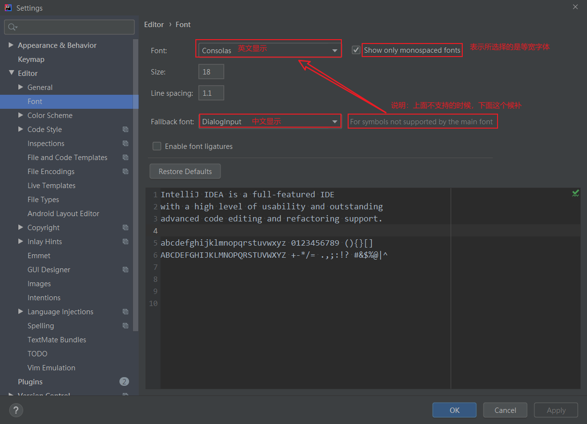

# IDEA 配置
## 主题设置
默认的`Darcula`

## 字体设置
[配置文件](ideaSettings/options/editor.xml)
位置：Editor > Colors & Fonts > Font

function | value
--- | ---
font | Consolas
Size | 18
Line Spacing | 1.1
Fallback font | DialogInput
 
* `Show only monospaced fonts`表示只显示系统上的等宽字体，取消勾选后，将显示系统上所有已安装的字体。
* `Fallback font(之前Secondary font)`表示备用字体，因为 IntelliJ IDEA 的编码字体有「第一字体」和「备用字体」之分，当有些字符在第一字体不能支持的时候，将会自动使用第二字体进行支持。
    > Consolas 显示英文的效果清晰，不紧凑。只支持英文。
     如果没有设置支持中文编码的时候，编辑界面出现中使用 DialogInput 支持中文显示，这个也是等宽的。这两个搭配效果还是不错的

## 插件
### ideaVim
[一些组合键的冲突解决配置](ideaSettings/options/vim_settings.xml)

## 遗憾
* 不能白嫖IDEA专业版。。。
* Windows下IntelliJ IDEA代码里的中文字符显示效果不好,大小不一、歪歪扭扭的,斜体时用字体也不一样。根据font配置配置一下中文字体即可。
    > 字体是到今天2022-01-16日，才发现原来可以设置两种字体来分别支英文和中文。已一瞬间感觉自己sb到家了。
